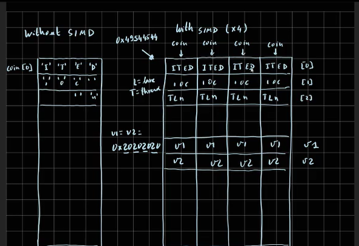
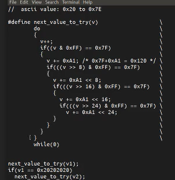
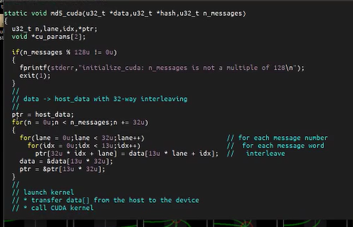
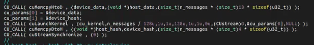
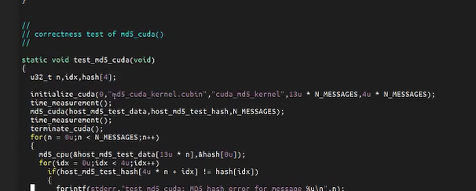
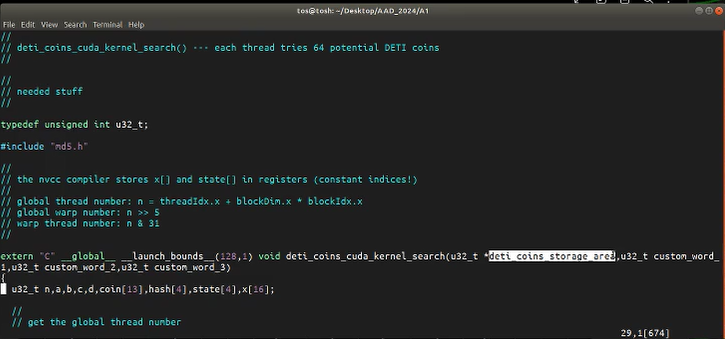
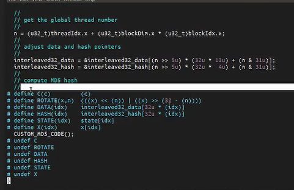
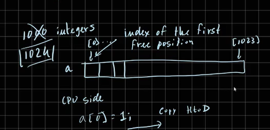

Hello guys. In this video, I will explain how you can search for Detticoins using CUDA. But first, let's start with what you have to do when you use, for example, AVX. In AVX, you have these four lanes, and you have to initialize each each potential coin, we have different lanes, with data, and then call the the MD5 function to compute the the hash and then test. In CUDA, you you only need to specify what's happening in one lane.

Okay? It it might be useful to, as I explained in a previous video, it might be useful to have a function that you can initialize one of these positions with random data, but let's start with spaces, and then it's useful to have a function that increments these values, but without leaving ASCII range. In the previous video, I put here a function to do this. Let me do it in a different way. You can also do it, for example, using something like this.

Okay? So you have you you have one value, v one. Okay? This v one. And then you can increase its value using something like this. This is on purpose a macro because you can place it in, for example, search utilities point h. And if you do if you do it in that way, you can use that macro, for example, for avx, avx2, and even if you like for CUDA. Okay? For CUDA, actually, it won't be necessary, but if you are adventurous, you can do it.

Okay. So you should use it this this way. This one increases the value of the v one. If it overflows, it end in the in the initial value, so you increase the v two. Okay.

So if you do this in this way, you can just update v1. Here, we have to update in all lanes, and v 2 if v 2 changes, you have to update in all lanes. For example, in CUDA, since you are going to do this only in in one lane, you only need to update one value. So let's continue with the CUDA stuff because I want to show you what's happening here in this md5_CUDA. We have here code that calls the the the calls the kernel on the CPU side.

So, sorry, on the on the on the graphics card side, but first, we need to rearrange the information. Okay? And then you have launched the kernel, rearrange the information on the other side, and then we compare it. Yeah. Here, in the tests, we compare it.

But if you are going to search for deti coins using CUDA, you you most definitely don't want to do this, because in the way this is being done, you have to transfer lots of information from the CPU to the graphics card, should be here in this in this data pointer, and then you return the ashes. That's a complete waste. So if you are going to do this in searching for the coins in CUDA, you are going to disregard almost everything here. The only thing that you are going to to use in some places will be something like this, 

but not exactly all this because, as I'm going to explain to you in a few moments, you don't need to transfer any data from the CPU side to the graphics card side. Eventually, and that's a good idea, you might it might be a good idea to transfer a v one and a v two value.

Okay. You can put you can put them in the in the arguments, and then again, I'm going to explain in a in a few moments, you transfer back only the information about deti coins. It will be a very, very small amount of information because deti coins are relatively rare. So you are you are not going to spend any time here, and you're going to going to spend a very, very small amount of time here. Okay?

But and then that's the interesting thing. You can you should initialize the CUDA in the in exactly this way. Okay? But, of course, instead of using this kernel, using your CUDA search kernel. Okay.

So this will be different, probably different name, different name for the kernel. This is the num the size of this, data array. 0, you don't need it, so you you you put it here, 0. And then this is the size of the output array. I think 1,000 should be enough.

So disregard all these numbers, just put 0 and 1,000. If you put 0 here, it will actually will not allocate space for this data array, neither in the CPU nor in the device. But if you put 1,000, here, it will allocate 1,000 integers both in the CPU and in the device. And that's how we are going to communicate the deti coins you found. Okay?

So this takes care of the and, of course, after after you do this, in the end, you should terminate CUDA, just in case. Anyway, there are a few things that that you have to pay attention because since you are going to look for deticoins in the graphics card, as I said, you need to see to specify only what's going to happen in one of these lanes. You you need to do something like this. Let me see if I come on. This is one.

I think I have already this opened. This is just a peek of my solution. If everything is in order, it will be it will go to the beginning of the file. Yes. So this is my solution for this for this for the the CPU side sorry, for the graphics card side of CUDA search, I have to declare an integer, include mv5.h as usual.

And then in the beginning, as I said, I'm going to pass a pointer to to to that 1,000 integer storage area. That's the that's where I'm going to store my my daddy coins, and I'm passing here v1, v2, and v3. I call them by different names, but that's what it is. Actually, this one is is overkill. You only need 2 and then inside I declare coin and hash inside.

Okay. I deposit using global memory. And then, of course, I'm going to build the information in this coin, as I did here in this lane. The first position will will have this information. The second first position index 0.

The second one will have this website, etcetera, etcetera, etcetera. Somewhere, I will put this v 1 and v 2, which I called here custom word 1 and custom word 2. And then I just compute the MD5 hash. I just have to include this part here. After doing this, I have to check if I have a Detticoin. That's very easy to do because in a Detticoin, the last word of the hash has to be 0. And if I have a Detticoin, I will have to store it. Okay.

Let let me explain now how you can store the Deticoins. It's here. So that one falls on the array area, and falls integers. It should be enough. Actually, I didn't use 1,000.

I used 1024, because it's power of 2, which is so in this storage area, I organized in this way. K? So we have 11 1 index 0, etcetera, etcetera, and last one will be index 1023. At the beginning, on the CPU side, let's call this array, say, for example, a. On the CPU side, I I do something like this, a0 equal to 1.

And this actually will mean the first index of the first free position. Okay? And then I make a copy copy of the entire actually, it's not necessary to copy everything, I only need to copy the first one. Let's make a copy from host to device. Okay.

So I transfer the information from the CPU to the graphics card, and then I call the kernel. And inside the kernel, When I have ready coins, that's what I do.

There is a function called atomic add, okay, atomic add. You can you can just use it inside the CUDA kernel, and this function does the following. It receives an address. Okay.

The address will be the address of the first position, so call it with just a, and an increment. Okay? And the increment, you want 14. Okay? Because each data coin will be 14 integers.

So in the middle of computation, you have something like this. This is the index 0 and you have at the beginning you have 1. When you have a data coins, you change this number. Instead of going to 1, it goes so this is index 1, and this is the index 1 plus 13. When you have a deti coin, you have plus equal 14 in this position, okay, in the first position.

But this has to be done using this atomic add. So you just pass the first argument, a, a will be the address of of of something in global memory, and you pass here 13, just to add 13 to to this value. This is an atomic yard, so this operation cannot be interrupted, and in the end, it is guaranteed that we have made the correct sum. But this function returns the old value. Okay?

This is specified here, hit blah blah blah blah blah and then returns returns the old value. Okay? So that's exactly what we need. So we do something like this, atomic add a, you make something like this, idx equal atomic add (a, 13). Okay?

And then you do something like this. If idx is smaller than or equal 1,000 minus 13, you have space to store the deticoin. So you store the deticoin like this, coin 0, idx plus 1. Oops. Sorry.

You are not seeing everything. idx plus 1, coin 1, idx point plus 2, coin 2, etcetera. In the end, when when the after the kernel has finished, you just copy this array back. So in the end, you do copy device to host, and then you process in the host the deti coins. The deti coins, you see, of course, you have to start in this position until the index is smaller than the value stored here.

You just copy the copy the deticoin to and actually you don't need to copy, you just just just have to call to save the deticoin. and that's the main idea. The only thing that that I that I did extra was the following. In each of my threads of the CUDA kernel, instead of computing only instead of testing only 1 deti coin, I test, for example, 95 deti coins or whatever. How how do I do that?

I just put here I do something inside the kernel. I utilize the coin array, and then I go, so for example, for i equal to 0, i smaller, say, you can choose any whatever you you like. I use 64, but 95 would be perhaps a better value, iaddadd. I just test for 1.20 coin, test for 1, and then in one of the positions, coin, for example, 12 plus plus.

So if I start with the with the space in the in the least significant byte of the coin, I just try the next value. So each thread is actually doing 64 or 95 or whatever tests. Why do I do this? To reduce overheads, because we have an overhead when we call a thread, when we create a thread. We have an overhead when we finish a thread, and we also have we have a small overhead when we copy information from one side to the other.

So if we spend more time inside the threads, that overhead will be less significant and actually we'll we'll do more tests per second. Okay. That's it.