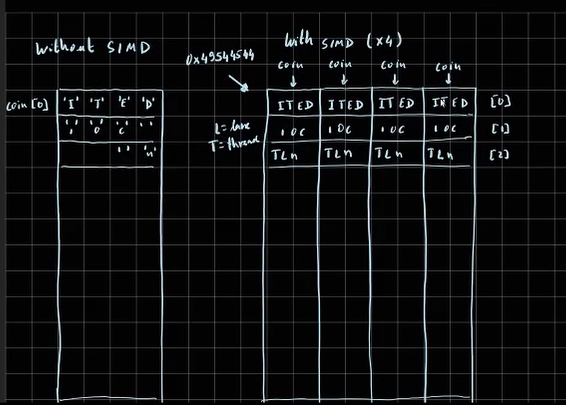
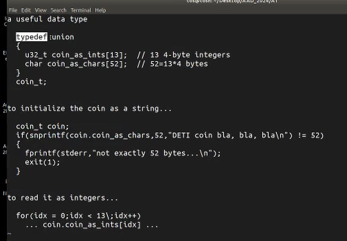
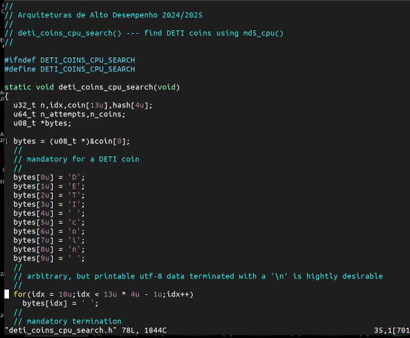
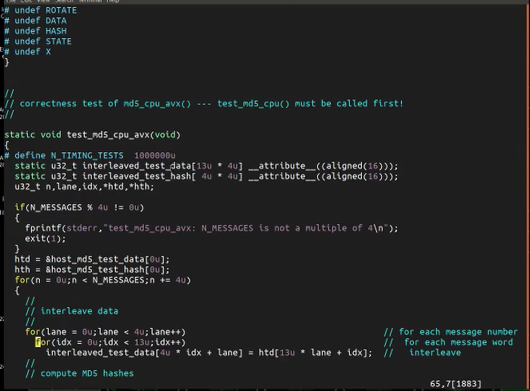
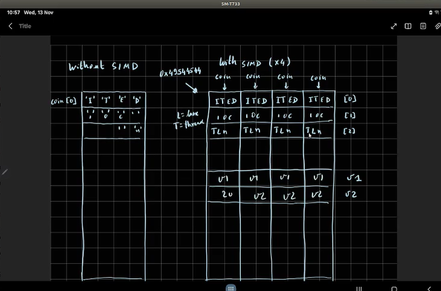
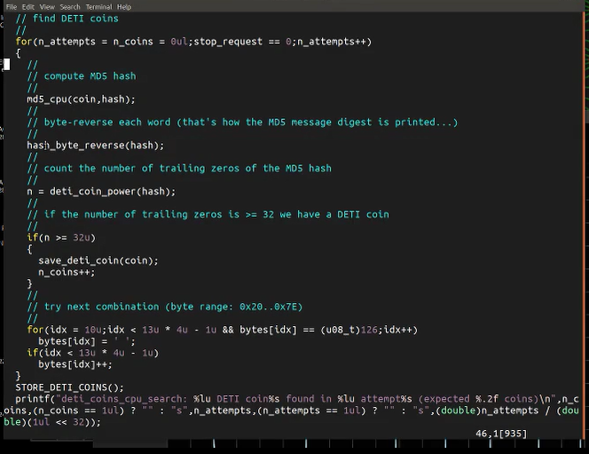
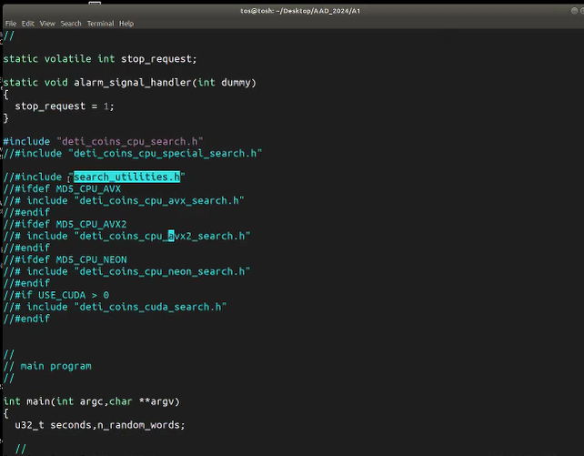
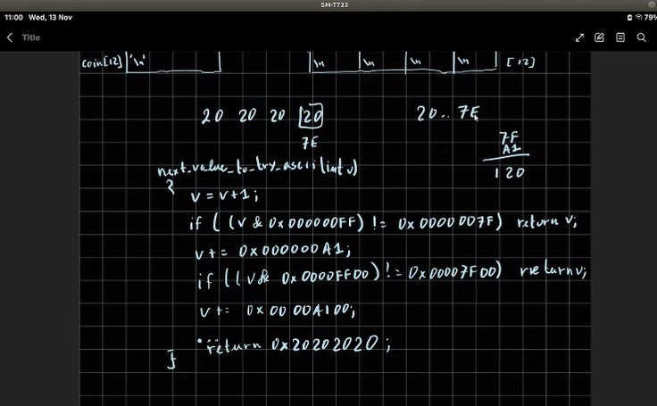

Hello? In this video, I will explain what's in most of the of the files that were provided. Well, no, I will not do it for all of them because some of them have as a small explanation that and I think that is enough. The main program is the decoys point c, and I will I will go over it in a in a few moments. Actually, you you will probably only need to change this one, 30 points point C.

The next files are already provided. You should you should not be it should not be necessary to change any one of these ones, except perhaps make file, not one you should should be able to. You you maybe may need to to change it. The the core of the of the code is MD 5.8. Let me show you what's in there.

This one is the is the contains the code that does the hard work, and hard work is to compute the MD5 message digest. This is done in using a macro. This is a c processor macro because c does not have templates. So we we want to use this code, the same code for making computations in the processor with or without SEMD instructions, but we also want to use this code for, for example, CUDA and OpenCL. So I did it.

I I constructed the macro in such a way that exactly the same the same code can be used for any in any of these situations. The only thing that that that you have to customize is other macros. This is a macro. This is another macro. It's this is another macro.

Macros are I wrote them using only capital letters. So that's the only thing you have to to adapt for your particular situation. Okay? Here at the beginning, there is a small explanation what is this. For example, for s e s e SIMD instructions, we have computations are being done are being done in parallel in several lanes.

So when you have to enter a constant, you actually have to enter the constant in each one of these lanes. So this macro can this macro can be adapted to do exactly that. On the other hand, when you use SCMD instructions, the compiler already knows how to do these operations. Okay? You don't have to do anything special.

It can handle it even. For example, if you if you if you if you look at what I've I've put here, you will see that I define the macros with appropriate values for the processors. For example, constant is itself. This is how we rotate the number x by n bits to the left, so rotation bits, bits leave one side and enter the other. This is how we access this, the input data.

Okay, this is input data. This is how you access output data. So in our custom MD5, code, we are we are dealing with exactly 52 bytes. 52 bytes are exactly 13 integers. And so this one reads them integer by integer.

This is the output. The the m d five sum, generates 128 bits. So that's 4 integers. This is how we access them. This is just access an element of an array.

The state and x are internal variables, so we have to define how we access them. It's just deep direct. And in the end, I I undefine again the macro macros because in the code, I will redefine them later on. Okay? So that this is how we do it on on a CPU.

This is how we do it on a CPU with a p with the SEMD instructions. In SEMD instructions, for example, when you use this AVX, we have registers with 128 bits. So we have to define a custom data type that can describe exactly one register for these ACMD instructions. For the GCC compiler, that's done in this way. Okay?

So this is an integer, but the integer actually this is is a vector, so an array of integers with exactly 16 bytes. 16 bytes means 4 integers because each integer is 4 bytes. So when we declare a variable with this type, the compiler already knows because you and here we declare them with these types. The compiler already knows that that these variables are going to be placed in registers with 128 bits. And it also knows how to do logical and arithmetic operations in parallel with them.

The only thing we need to specify is how to enter a constant. We we need to enter a constant 4 times. Okay? This is an array of 4 elements, and in the end, I'm I make a cast to the property type so the compliant the compiler doesn't complain. We have to also to specify how to rotate, and here I am using a built in instruction that the GCC compiler and C lang compilers understand that rotates things.

When you you when you adapt this to AVX 2, you will need to change here, perhaps 4 to 8, 16 to 32, and of course, 8 almost everywhere, 8 interleaved message, 8 interleaved MDC MD5 hashes. Here, we have to do you have to do it 8 times instead of 4, and the name of this thing will not be 128. It will probably be 256 256. The rest is almost the same. Actually, it's the same.

Of course, you need to change the name of the functions, and then you need to to change the code that confirms that your the computations are being done correctly. Okay. Neon code is almost exactly the same. If you compare them, you will see differences are mostly cosmetic. So I am changing the name of the function, changing the name of the define.

The built in is different, the number of function is different, the data type is different because when you are using Arm you include this file and it has almost everything done for you. And the rest is almost the same. It's just changing AVX with Nian almost everywhere. Actually, it's nothing else. And the name of the data type is also different, but the rest is the same.

Okay. So when you do this, when you do this CPU search using AVX instructions, doing it with Neon is almost exactly the same. I'm not going over the in this video what is going to happen with CUDA, but reserved for another video. Okay? Things that you should keep should should pay attention.

I, I, the thing I've done here is I first made made the complete code, the entire code, my personal code and then I cut parts of it and the parts that I have included are the parts that you are supposed to do. But you are not you can do it any way you like. You you you you cannot you do not need to follow my suggestions. And I here I have suggestions, for example. AVX 2.

I put here in comment include CPU AVX 2. H. Okay? You can make a copy of this file to this one, make the appropriate changes, and then remove this comment. And the the way I did the code with point h files is precisely because if if you do things in this way if I do this and if you put everything here in the appropriate way, the rest of the code is already made for you.

For example, AVX 2. Here, when I make tests to make sure that this one is is working, I test the macro that should be defined in the AVX point 2 point AVX 2.h file. If you provide that that function in there, it will test automatically. Okay? And likewise, if you do a CPU search, for example, if if you define this macro in the appropriate file, so if you have AVX two code, you can include this one to do the search using AVX two, etcetera etcetera etcetera for almost everything.

So these comments I have played I have put here are comments that you that it's not it's not necessary you do things in this way. Okay? One of the things, by the way, that you should try to start your work would perhaps be starting with this one and making a copy of it and then creating this one. So for doing this, the special coins, that's that's the part here at the end. Okay.

For example, this point end. Special form. I will go over this in a in a few moments. Okay? And after that, you should try to do this one.

After doing this one, this one and this one are almost the same. This one, as I said, let's leave this for another video. So let's let me give you now a few a few ideas about how to go doing this, deticoin search because in the in the in our classes Monday, I noticed and and Tuesday I noticed that you were having a little difficulty initializing this this thing. Okay? So let's let's let's go over it in a little more detail.

So when you do when you are doing only 1 computation at a time, so, for example, in a processor without SIMD instructions, by the way, that's more or less how we are going to do it with CUDA. You specify exactly what's going on what's going on in one lane and the and the other lanes are dealt with automatically. You have to put the string deticoins, etcetera, in in your coin. Okay? And this will be come on.

This will be 13 integers index 0 to 12. This part is fixed. The rest is arbitrary. But when you when you do it using SIMD instructions, you have, for example, using AVX. You have 4 lanes, you have to put the same information in each lane, but then you have to make variation.

It cannot be exactly the same information because if it's exactly the same information, you you would be computing the same thing several times. So that's not a good idea. So my suggestion, and I'm going to, in a few moments explain how you can put this information in a very simple way. You can, for example, the first 10 bytes are mandatory, this is a space, this is, sorry, this is wrong, the end it's n space and not space n. My suggestion is the following.

The next character, this one is the first one that is arbitrary, could be, for example, the lane number, lane 0, lane 1, lane 2, lane 3. So what you could put here ASCII code ASCII code for 0, for 1, for 2, and for 3. And if you are using, for example, AVX 2, 01234567. Okay? But I am also asking you to do it using OpenMP or p threads.

K? So you will have a multi threaded implementation. So if you have several threads, I also suggest that you place in the next the next character the number of the thread. Okay? For example, if you have 4 cores, the first thread will be, for example, thread number 0.

You place here 0 0 0 0. Okay? For the 1st thread. For the 2nd thread, you place here 1111. If you do things in that in in this way, each thread  will be drawing coins that are different because this specific character will be different from thread to thread.

And this one, of course, will be different from lane to lane. Okay? The rest is almost arbitrary. Okay? But as I said, please try to use ASCII or UTF 8 characters.

To finish this part, let me explain then how you can enter the information. Let me put here this again. How you can enter the information here in a simple way. In in in in this week's classes, I suggest that you enter the ASCII codes here 1 by 1. You have, for example, you have, for example, 44, 45, 54, and 49.

This this four ones will go in the first integer. The least significant one is the first is the first character of the string because we are working with little engine architectures. So the things that you have to put is 44, then 45, then 54, and then 49. But that is not it's not it's not difficult, but it's not as easy as as it can be. Because I have here a suggestion, and this suggestion is the following.

Okay. You can define a new data type. Probably you have not yet used this union thing. When you have a structure, we have you have several fields, and the fields are, for example, consecutive in memory. When you have a union, these fields occupy the same space.

They are overlap they overlap. That stuff overlaps. That is one over the other. So I can have this union thing and I can look at the contents of union as integers, 13 integers, but I can also look at them as, for example, 32 charters. So we we can write as charters and read as integers.

K? So that's that's the best way to to to enter the information. I have here, for example, how you can initialize deticoin using a string. I declared here the the the variable. Okay?

It's it's a coin. It's this of this type, and then I can place the text as a string in there. Okay? Instead of using s printf, I use snprintf because snprintf ensures that you cannot write more than 32 bytes. Okay?

So even if you make a mistake and you put here more than 32 bytes, it will only store 32 bytes here in the in the array. Actually, if you do this in this exactly way and if this thing has exactly 32 bytes, this this function will will attempt to write 33 bytes because it will have to also it will also attempt to write the string terminator. This one will not allow that, and in the end, you have to write exactly 32 characters, not including the terminator. So if it is not 32, you have not initialized everything. If it's more, you have you have more characters than than than what's what's what's supposed to be.

If you have less, okay, you are ending earlier. So put your text here. This is good for custom deti coins. Put your text here. Remember that you are going to try several patterns until you get a Lety coin.

This is a simple way to do it. So you can utilize the coin in this way using a string, and then you can read it as integers. Okay. Of course, this thing here is you have you may have code to print or assign it to something else. This can be, for example, a comma.

So this is the thing that  assesses the  coin as integers. Okay? I think doing things in this way will make things easier for you. Okay. So it's now time to go over how we handle variations in the coins.

So here, just to make things a little more complicated for you, I decided to initialize the coins, using a pointer to a character array.

Initialize them 1 by 1. If you use this snprintf, you can do it all in one go. Okay? Easier. And then you have to do this several attempts.

Okay? If you if you are doing this, for example, using AVX instruct is SIMD instructions, you are doing 4 at a time, so the number of attempts should grow. Instead of adding 1, you should afford because in each loop iteration, you will do 4 at a time. You will probably need to put here, this part.

You have to to initialize this thing, this data structure. This this will be kind of a matrix with 13 lines and 4 columns. So but you can get inspiration from this thing.

Right? Because this is done here. I did it here with an unidimensional array, but I could have done it also as a bidirectional array, for example, something like this. Layout in memory would be the same, but actually it is easier for me to handle things using an unidirectional array, me doing the index computations, because in CUDA, it's easier to do it that way. So as I was saying, you have to put here something to to utilize the data structure in the appropriate way.

I suggest that you have here somewhere, for example, here. Let me me do it in this way. For example, you you can have here 1 variable. I let's call them v 1 and v 2. You put here v 1, v 1, v 1, v 1, v 2, v 2, v 2, v 2.

Oops. And you start, for example, with v one equal to v 2 equal, for example, 20 20 20 20 is 4 spaces because the ASCII code for a space is 32 and 32 is 20 in a in in hexadecimal. So this is a space space space space. So your first attempt, you use spaces everywhere. Okay?

And then you try you have to try this. You compute this, but actually, you'll get 4. You you have here to put the 4 cycle from 0 to 4 to examine each one, and then you have to update update the the your point. So you should change one of these two variables. Okay.

So I'm going to do it. I'm going to explain it in a moment because I because you have to do this with AVX, with AVX 2, and with CUDA. Okay. So if you have a, a general way of doing this, you can you can reuse it. That's why I have here.

That's why I have here this includes such utilities. It's it's just a suggestion. You can place, in there a function that, for example, increments this variable, but increments, for example, going over only ASCII codes. That's why also but that's not necessary. When I have this search utilities included, I also I also have a function called next value to try in ASCII and also I can play I can create a function to test if it is working correctly.

So that I put it here because when when I write code, I also include code to test the functions that I am going to use. Okay. So let's go over that part, which is the following. So imagine that you have this function, so you get you want to go over 20 20 20 20, which is a space, and ASCII codes start at 20, ends at 7 e? ASCII?

So you each one of these 4 bytes you want to go over all cases. So you can write a function that it's actually something like this. Sorry. I made it here. It's not exactly perfect.

It should return an int. Actually, it should be instead of int, it should be 0 52d. Okay? And here also as well. So what I'm what I'm going to do here is is following.

Okay. So let's start adding 1 to this least significant byte. Add 1 and then I'm going to test if this byte is 7 F because 7 F is the first value we do not want. So what I do is I apply here a mask, this mask with this and operator actually extracts the list from significant byte, places 0s in the other bytes, replaces them with zeros, and then I compare it with 7 f. If it's not 7 f, we have not we have a valid code, for example, 21, 22 or even 7e.

So if it's not, if if you do not have an overflow, I just return it. Otherwise, I have to replace the 7f that was here with 20 and I have to add 1 in the next position. The way to do it is just you just need to add a one, because you have 7F, if you have a one, 7F plus a one is this thing, so it will place 20 here and add 1 in the next byte. And again, we isolate that byte using a mask with which replaces all the other bytes with 0s and we compare it with 7f. If it's not 7f, okay, it's good.

There is no overflow. Otherwise, we need to add something, but now shift it 1 byte and then we have to do it again, testing this one and testing this one. In the worst possible situation, we have 7e, 7e, 7e, 7e, add 1, add 1, add 1, add 1, and then this will go around and we will return 20 20 20 20, which is again, spaces. So how can you use this? 

In this code here, you try, you will try one combination, you need to initialize the appropriate data structure with the contents of the coin.

This  can be, for example, index 5 and index 6 or whatever you like. 2 are enough, there's probably no need to have a v3 because if you do it things in this way, you will have 95 sorry. You will have 95 raised to 4 possibilities just for v one.

And if you do it also for v two, it will be 95 raised to the 8th power and that's enough. This will keep the even good graphic cards occupied for hours. Okay? So there's no need for more.

You call this function. You do say things something like this. Let me do it here. You you do something like this. V one equal next value to try, v one.

And then you do this if v one is equal 0x20202020. This means that it overflow. We do the same thing with v 2. Next, value to try. V 2.

And there's no need for the v three. And then, of course, you do your data, whatever whatever. For example, lane 6. Index 6. For example, 6 lane. If you do, of course, do it for lane equal to 0. Lane smaller than, for example, 4, laneplusplus. To do it for her, and then put here v one, and then you do the same thing, but for the next index.

Lane equal to V 2. And you do it do this for all lanes, and you have now all the information ready for you to try the next potential coins. Okay? Because you have changed this here, and you have changed this here. And then you have different combination.

If you do this different lanes here, different numbers here. For threads, different numbers here. You are trying different coins in parallel. Okay? So that's the main thing.

And that's it for this video.