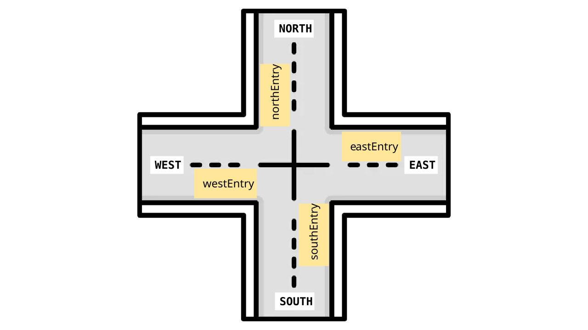

# MT-City Traffic - Multithreaded City Simulation

This project is a multithreaded traffic simulation developed for the **Sistemas Distribuídos (SD)** course at the **University of Aveiro (UAveiro)**, academic year 2025/2026.

## Project Overview

**MT-City Traffic** is a multithreaded simulation of autonomous vehicles navigating a city grid. The system models realistic constraints such as:

- **Traffic Management**: Vehicles traverse intersections while respecting traffic rules and avoiding collisions
- **Battery Management**: Vehicles consume power while traveling between and traversing intersections
- **Charging Infrastructure**: Vehicles can recharge at charging stations across the city. They are evenly distributed throughout the city grid.
- **Concurrent Operations**: Multiple vehicles operate independently as concurrent threads, creating a realistic urban traffic simulation

### Key Features

- **Multithreaded Architecture**: Each vehicle runs as an independent thread
- **Synchronization-Heavy Design**: Demonstrates advanced Java concurrency primitives (`ReentrantLock`, `Condition` variables, `AtomicInteger`)
- **Grid-Based Navigation**: Vehicles navigate on an N×M grid of intersections
- **Smart Pathfinding**: Vehicles use Manhattan distance pathfinding and dynamically reroute to charging stations when battery is low
- **Collision Detection**: Intelligent collision detection at intersections ensures safe multi-vehicle passages
- **Real-Time GUI**: Optional graphical visualization of vehicle movements and simulation state

## Getting Started

### Building the Project

You can use the provided `makefile` to build and manage the project:

```bash
# Compile the source code
make compile

# Clean build artifacts
make clean
```

### Running the Simulation

Use the `run` script or the `make run` command. The simulation supports several command-line arguments thanks to [picocli](https://picocli.info/).

```bash
# Basic run with default parameters
make run

# Run with custom parameters
./run --rows 10 --cols 10 --vehicle 20 --steps 100 --time 50
```

**Note**: The `run` script compiles the project before executing.

#### Command-Line Options

| Option      | Shorthand | Description                                 | Default |
| :---------- | :-------- | :------------------------------------------ | :------ |
| `--time`    | `-t`      | Time unit duration in milliseconds          | 1       |
| `--rows`    | `-r`      | Number of rows in the City Map              | 5       |
| `--cols`    | `-c`      | Number of columns in the City Map           | 5       |
| `--steps`   | `-s`      | Total number of simulation steps            | 10      |
| `--vehicle` | `-v`      | Number of vehicles to spawn                 | 5       |
| `--gui`     | `-g`      | Flag to enable the Graphical User Interface | false   |

## Project Structure

- `src/main/java/deti/sd/mt/ct/Simulation.java`: Main entry point and orchestration.
- `src/main/java/deti/sd/mt/ct/core/`:
  - `CityMap.java`: Grid representation of the city.
  - `Intersection.java`: Logic for handling traffic at intersections.
  - `Vehicle.java`: Autonomous vehicle logic (Thread-based).
  - `ChargingStation.java`: Infrastructure for vehicle recharging.
- `src/main/java/deti/sd/mt/ct/model/`: Common data types like `Coordinate`, `Direction` and `MoveType` and `Collision`, which handles intersection collision logic.
- `src/main/java/deti/sd/mt/ct/ui/`: Components for the simulation GUI.

## Synchronization Strategy

The system uses a **lock-based synchronization approach** built entirely on `java.util.concurrent` primitives. The goal is to enable safe concurrent access to shared resources while maintaining collision safety and preventing resource starvation.

### 1. Intersection Synchronization

Intersections are the critical coordination points where vehicles may collide. The synchronization strategy employs a **two-level locking mechanism**:

#### Entry Direction Locks

- **Concept**: Four separate `ReentrantLock` instances (one per cardinal direction: `northEntry`,`southEntry`,`eastEntry`,`westEntry`)
- **Purpose**: Ensures only one vehicle can enter the intersection from each direction at a time
- **Fair Mode**: Set to `fair=true` to prevent starvation under high contention
- **Benefit**: Breaks down contention—vehicles entering from different directions don't block each other



#### State Lock with Condition Variables

- **Concept**: A central `ReentrantLock (stateLock)` protecting the intersection state and a `Condition (noConflict)`
- **State Tracking**: Tracks which vehicles are currently inside and their trajectories (entry direction and move type)
- **Collision Detection**: Before entering, vehicles check if their trajectory conflicts with currently occupant vehicles using `Collision.collides()`
- **Waiting Mechanism**: If a conflict is detected, the vehicle calls `noConflict.await()` and yields the lock, waiting for other vehicles to exit
- **Notification**: When a vehicle exits, it calls `noConflict.signalAll()` to wake all waiting vehicles for re-evaluation

**Enter-Traverse-Exit Protocol**:

```
Vehicle.enter()  → acquire entry direction lock → wait for no conflicts
Vehicle.traverse() → simulate movement (holding locks)
Vehicle.exit()   → release entry lock + notify waiting vehicles
```

### 2. Charging Station Synchronization

Charging stations manage two limited resources: **plugs** and **power**. Synchronization ensures vehicles don't exceed available capacity.

#### Lock and Condition Pattern

- **Concept**: A single `ReentrantLock (chargingLock, fair=true)` protects both plug and power availability
- **Condition Variable**: `resourcesAvailable` allows vehicles to wait atomically for both resources
- **Atomic Acquisition**: Both plugs and power are acquired/released within the same locked section - no race conditions between checking and consuming resources

#### Two-Phase Resource Management

1. **Acquisition Phase**: Vehicle waits for `(availablePlugs ≥ 1) && (availablePower ≥ amountNeeded)`
2. **Charging Phase**: Lock is **released** during simulated charging, allowing other vehicles to acquire plugs while this vehicle charges
3. **Release Phase**: Vehicle re-acquires lock and returns resources, then calls `signalAll()` to wake waiting vehicles

This design allows the station to serve multiple vehicles in parallel (up to `numPlugs`), with only brief lock contention during resource transitions.

### 3. Vehicle State Management

- **Atomic Counters**: `AtomicInteger` for global vehicle ID generation
- **Local State**: Path computation, movement decisions, and destination tracking are entirely local (no sharing between vehicles)
- **Volatile Flags**: `finished` and `charging` flags are volatile for visibility across threads without full synchronization overhead
- **Battery Depletion**: If battery reaches 0, the vehicle's loop terminates immediately

### 4. CityMap (Grid) Management

- **Read-Only After Initialization**: The grid structure is built once during simulation setup; vehicles only read intersection references
- **No Synchronization Needed**: Reads to the grid are thread-safe because no modifications occur during the simulation
- **Atomic Queries**: Methods like `findNearestChargerIntersection()` use BFS locally without affecting other vehicles

---

## Deadlock and Starvation Prevention

### Deadlock Prevention

1. **No Circular Lock Dependencies**
   - Vehicles never hold an intersection entry lock while waiting for a charging station, or vice versa
   - When routing to a charger, vehicles release the current intersection lock before attempting to enter the charging station
   - Resources are well-ordered: intersection entry lock → state lock → charger lock, with no reverse dependencies

2. **Atomic Lock Acquisition with Timeouts (Implicit)**
   - Locks are held for minimal durations; vehicles don't accumulate multiple locks simultaneously
   - Charging happens **outside** the charging station lock, so the lock is not held during the entire charging simulation
   - Entry/exit operations at intersections are quick: check conflicts, update state, signal—then release

3. **Condition Variables Instead of Busy-Waiting**
   - Threads call `await()` on conditions rather than spinning or holding locks in loops
   - `await()` atomically releases the lock while waiting, allowing other threads to make progress
   - Example: Vehicle waiting for intersection space releases the state lock, enabling other vehicles to exit and free up space

4. **No Hold-and-Wait Pattern**
   - When a vehicle needs to access a resource (intersection, charger), it acquires locks in a strict order
   - It doesn't acquire a lock, then wait for another—if the second is unavailable, it releases and retries

### Starvation Prevention

1. **Fair Locks (`ReentrantLock(fair=true)`)**
   - All locks (`northEntry`, `southEntry`, `eastEntry`, `westEntry`, `stateLock`, `chargingLock`) use fair queuing
   - Threads waiting for a lock are served in **FIFO order**, not arbitrarily
   - A vehicle that starts waiting will eventually get a turn, proportional to fair queuing

2. **Signaling All Waiting Threads (`signalAll()`)**
   - Instead of waking only one thread (`signal()`), the code uses `signalAll()` throughout
   - When a vehicle exits an intersection: `noConflict.signalAll()` wakes all waiting vehicles
   - When a vehicle finishes charging: `resourcesAvailable.signalAll()` wakes all waiting vehicles
   - Prevents situations where a vehicle indefinitely waits while others proceed

3. **No Selection Bias in Collision Detection**
   - Vehicles don't have priority levels or permanent blocking
   - The `conflictsWithCurrentOccupants()` check is agnostic; all vehicles are treated equally
   - Vehicles retry after `await()` returns, giving them a fair chance on each attempt

4. Consistent State Cleanup
  - When a vehicle exits an intersection or releases charger resources, state is always cleaned up
  - This prevents leaked resources that could cause indefinite waiting

---

## 2.6 Extra Task: Priority-Based Traffic

As an additional feature, we implemented a priority system to simulate **Emergency Vehicles** (like ambulances or fire trucks) that require preferential access to city resources.

### Implementation Details

We introduced a `VehiclePriority` enum (`NORMAL` and `EMERGENCY`) and updated the vehicle spawning logic so that approximately 10% of the fleet consists of emergency vehicles. These vehicles are visually distinguished in the GUI by their **Red color** and **"E" prefix** (e.g., E1, E2).

The core of the priority logic resides in how these vehicles interact with Intersections and Charging Stations:

1.  **Waiting Signaling**: Both `Intersection` and `ChargingStation` now maintain a thread-safe counter (`waitingEmergencyCount`) that tracks how many emergency vehicles are currently queued for that resource.
2.  **Intersection Priority**:
    *   **Emergency Vehicles**: They only wait if there is a physical conflict (another vehicle is already traversing the path). They ignore the queue of normal vehicles.
    *   **Normal Vehicles**: Before entering, they check if `waitingEmergencyCount > 0`. If any emergency vehicle is waiting, the normal vehicle yields and stays in the `await()` state, even if the intersection is physically clear.
3.  **Charging Station Priority**:
    *   Similarly, when a charging plug or power becomes available, waiting emergency vehicles are served before any normal vehicles, regardless of who arrived first.

This approach ensures that emergency services can navigate the city with minimal delay, reflecting real-world traffic priority while still maintaining the safety and integrity of the simulation's synchronization.

